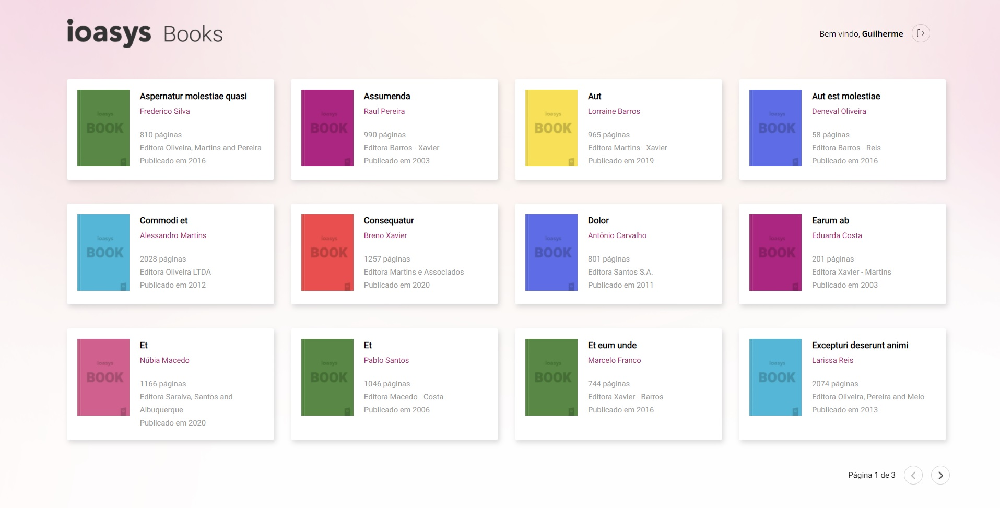

## ReactJS Book Store Test



* Node utilizado: 12.20.1

* Ao logar (com o usuário: desafio@ioasys.com.br e senha: 12341234; é salvo um token no localStorage
* P/ consultar a API utilizada : https://books.ioasys.com.br/api/docs/#/Books/getBooks


* Para rodar o projeto:
```sh
npm install && npm start
```


### To-Do:
* Melhorar CSS (de preferência utilizando SASS ou LESS)
* Utilizar refresh token
* Configurar task manager
